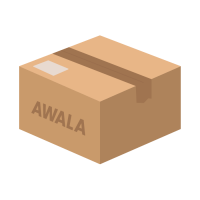

# Awala Gateway for Desktop

The Awala Gateway for Desktop is a _[private gateway](https://specs.awala.network/RS-000#concepts)_ for Windows 8+ and Linux desktops, with experimental support for macOS. The installers can be found in [the latest GitHub release](https://github.com/relaycorp/awala-gateway-desktop/releases/latest).

This repository contains the source code for the app, which is also a reference implementation of a private gateway in the Awala protocol suite.

This document is aimed at advanced users and (prospective) contributors. We aim to make the app as simple and intuitive as possible, and we're therefore not planning on publishing end-user documentation at this point. To learn more about _using_ Awala, visit [awala.network/users](https://awala.network/users).

## Awala bindings

This private gateway implements [Awala bindings](https://specs.awala.network/RS-000#message-transport-bindings) as follows:

- Local endpoints communicate with the private gateway via a [PoWeb](https://specs.awala.network/RS-016) server on `127.0.0.1:13276`. This server is implemented with the PoWeb binding, and the [Fastify](https://www.fastify.io/) and [`ws`](https://github.com/websockets/ws) servers.
- When the Internet is available and the public gateway is reachable, this private gateway will communicate with its public counterpart using [Relaycorp's PoWeb client](https://github.com/relaycorp/relaynet-poweb-js).
- When communicating with couriers over WiFi, this private gateway uses the [CogRPC binding](https://specs.awala.network/RS-008) through [Relaycorp's CogRPC client](https://github.com/relaycorp/relaynet-cogrpc-js).

The local communication with endpoints does not use TLS, but all other connections are external and therefore require TLS.

By default, instances of this gateway are paired to [Relaycorp's Frankfurt gateway](https://github.com/relaycorp/cloud-gateway/tree/main/environments/frankfurt).

## Security and privacy considerations

The items below summarize the security and privacy considerations specific to this app. For a more general overview of the security considerations in Awala, please refer to [RS-019](https://specs.awala.network/RS-019).

### No encryption at rest

This app does not (currently) support encryption at rest, so a malicious app on your computer could get hold of the private keys used by this gateway. Users are highly encouraged to use full-disk encryption to protect such keys in the event of theft or loss.

Note that because Awala employs end-to-end encryption, compromising these keys won't compromise the encryption of the messages exchanged by your Awala-compatible apps. The keys of any private gateway are primarily used to sign messages and issue Awala PKI certificates, and to encrypt/decrypt cargo exchanged with its public gateway.

### External communication

In addition to communicating with its public gateway, this app communicates with the following:

- `https://cloudflare-dns.com/dns-query` as the DNS-over-HTTPS (DoH) resolver. DoH is only used to resolve SRV records for the public gateway (e.g., [`_awala-gsc._tcp.frankfurt.relaycorp.cloud`](https://mxtoolbox.com/SuperTool.aspx?action=srv%3a_awala-gsc._tcp.frankfurt.relaycorp.cloud&run=toolpage)), as we delegate the DNSSEC validation to the DoH resolver.
- The host running the DHCP server on port `21473`, when the device is connected to a WiFi network but disconnected from the Internet. We do this to check whether the device is connected to the WiFi hotspot of a courier.
- Other apps on the same device can potentially communicate with the local PoWeb server provided by this app on `127.0.0.1:13276`. Because this server uses the HTTP and WebSocket protocols, we block web browser requests by disabling CORS and refusing WebSocket connections with the `Origin` header (per the PoWeb specification).

This app doesn't track usage (for example, using Google Analytics), nor does it use ads.

### App signing

The Windows installed is signed with a certificate issued to `Relaycorp, Inc.`.

## Naming rationale

We're referring to this app as "Awala" in the user interface, even though this is obviously one of the components that make up the network, in order to hide technical details from the end user. The terms "private gateway" or "gateway" may be more accurate, but we don't think they sound user-friendly.

However, we do use the terms "private gateway" or "gateway" in the code base because we absolutely need accuracy there.

## Development

### System dependencies

You only need Node.js 14+ installed.

### Setup

```shell
npm install
npm run bootstrap
```

### Code structure

This is a monorepo and all components can be found under [`packages`](./packages).

## Contributing

We love contributions! If you haven't contributed to a Relaycorp project before, please take a minute to [read our guidelines](https://github.com/relaycorp/.github/blob/master/CONTRIBUTING.md) first.
